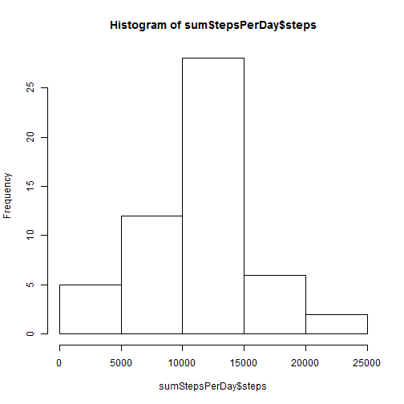
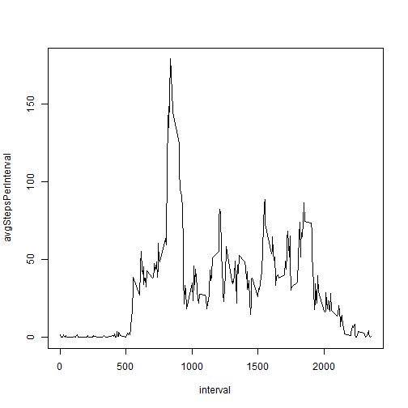
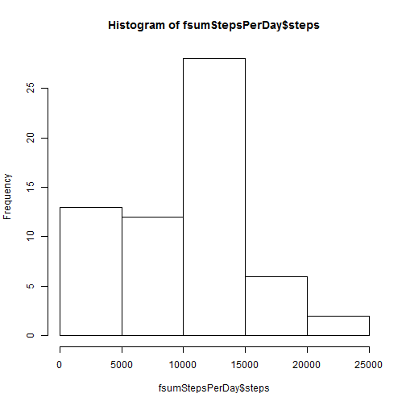
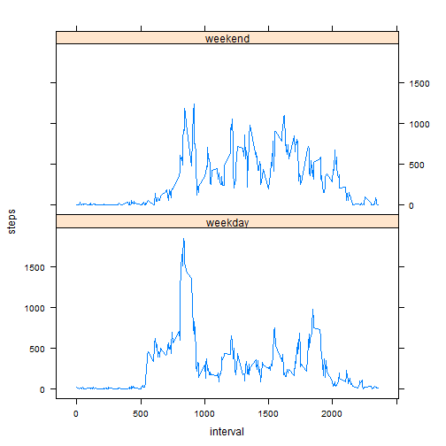

# Reproducible Research: Peer Assessment 1
Author: Silmandil

```r
library(plyr)
```

## Loading and preprocessing the data
Start by unzipping the archive.

```r
unzip("activity.zip")
```
Then read in the data:

```r
dt <- read.csv("activity.csv")
```

## What is mean total number of steps taken per day?

```r
sumStepsPerDay <- ddply(dt, .(date), function(x) numcolwise(sum)(x))
hist(sumStepsPerDay$steps)
```

 

```r
meanSpD <- mean(sumStepsPerDay$steps, na.rm=TRUE)
medianSpD <- median(sumStepsPerDay$steps, na.rm=TRUE)
print(paste("Mean: ", meanSpD, "  Median: ", medianSpD, sep=""))
```

```
## [1] "Mean: 10766.1886792453  Median: 10765"
```
The mean is 1.0766 &times; 10<sup>4</sup> and the median is 10765.

## What is the average daily activity pattern?

```r
numberOfDays <- length(sumStepsPerDay$steps)
sumStepsPerInterval <- ddply(dt, .(interval), function(x) numcolwise(sum)(x, na.rm=TRUE))
avgStepsPerInterval <- sumStepsPerInterval$steps/numberOfDays
with(sumStepsPerInterval, plot(interval, avgStepsPerInterval, type="l")     )
```

 

```r
maxInterval <- which.max(avgStepsPerInterval)
```
The interval with most steps is 835.

## Imputing missing values

```r
cc <- complete.cases(dt)
missing_rows <- sum(!cc)
```
The number of rows with missing values is 2304.

The 'best' way to impute the missing values is to substitute the median of the interval for that particular day of the week. But that's a lot of work. Lets just use the median value of that interval (over all days). 

```r
medianStepsPerInterval <- ddply(dt, .(interval), function(x) numcolwise(median)(x, na.rm=TRUE))
sum(is.na(dt$interval))
```

```
## [1] 0
```

```r
sum(is.na(dt$date))
```

```
## [1] 0
```
There are no missing values in interval or date so the transformation is simpler than it could have been.


```r
ct <- dt
mt <- merge(dt,medianStepsPerInterval, by="interval", sort=FALSE)
mt$steps <- mt$steps.x
mtna <- is.na(mt$steps)
mt$steps[mtna] <- mt$steps.y[mtna]
mt$steps.x <- NULL
mt$steps.y <- NULL

fsumStepsPerDay <- ddply(mt, .(date), function(x) numcolwise(sum)(x))
hist(fsumStepsPerDay$steps)
```

 

```r
fmeanSpD <- mean(fsumStepsPerDay$steps, na.rm=TRUE)
fmedianSpD <- median(fsumStepsPerDay$steps, na.rm=TRUE)
```
The new mean is 9503.8689 and the new median is 10395.
The new mean is 88.2751% of the original.
The new mean is 96.5629% of the original.
It seems most of the missing values were 0, or at least less than the mean and the median.

## Are there differences in activity patterns between weekdays and weekends?

```r
library(lattice)
mt$weekdays <- weekdays(as.Date(mt$date))
mtweekend <- grepl("Saturday|Sunday", mt$weekdays)
mt$daytype <- "weekday"
mt$daytype[mtweekend] <- "weekend"

wPerInterval <- ddply(mt, .(interval, daytype), function(x) numcolwise(sum)(x, na.rm=TRUE))
wpiweekend <- grepl("weekend", wPerInterval$daytype)
wPerInterval$steps[wpiweekend] <- wPerInterval$steps[wpiweekend]/2
wPerInterval$steps[!wpiweekend] <- wPerInterval$steps[!wpiweekend]/5
xyplot(steps~interval|daytype, data=wPerInterval, layout=c(1,2), type="l")
```

 

